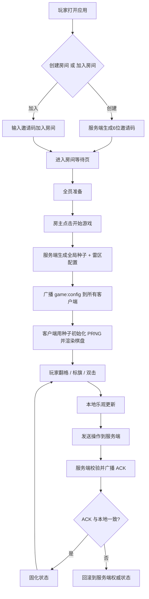
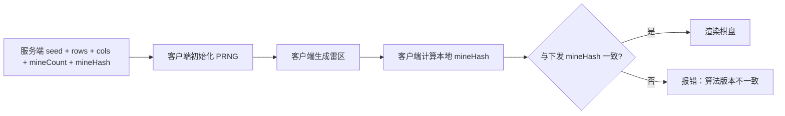

# 协同排雷（Coop Minesweeper）产品需求文档 PRD

## 1. 产品概述

协同排雷是一款多人在线合作扫雷游戏，第 1-2 周目标是跑通「种子同步」与「无冲突的单人翻格」基础链路。服务端生成全局唯一种子，所有客户端基于同一份确定性算法源码自行渲染完全一致的雷区；玩家可创建/加入房间协同排雷，操作采用本地乐观更新 + 服务端 ACK 固化机制，并实现简易的服务端权威计时同步。

- **目标用户**：喜欢合作解谜、追求确定性公平对局的玩家。
- **核心价值**：用「种子驱动 + 算法同源」消除传输开销与作弊空间，保证所有玩家雷区绝对一致；用「乐观更新 + ACK」兼顾流畅与权威。

## 2. 核心功能

### 2.1 用户角色

| 角色 | 进入方式 | 核心权限 |
|------|---------------------|------------------|
| 房主 | 创建房间，系统生成 6 位邀请码 | 选择难度、开始游戏、重置棋盘 |
| 玩家 | 输入邀请码加入房间 | 翻格、标旗/问号、双击展开、准备/取消准备 |

### 2.2 功能模块

1. **大厅页**：创建房间（选择难度）、输入邀请码加入房间。
2. **房间页**：邀请码展示与复制、玩家列表（区分房主/准备状态）、难度信息、开始/准备按钮、操作日志。
3. **游戏区**：确定性雷区棋盘、剩余雷数、计时器（服务端权威）、操作面板。

### 2.3 页面详情

| 页面名称 | 模块名称 | 功能描述 |
|-----------|-------------|---------------------|
| 大厅页 | 创建房间卡片 | 选择难度（初级/中级/高级），点击创建生成邀请码并跳转 |
| 大厅页 | 加入房间卡片 | 输入 6 位邀请码加入对应房间 |
| 房间页 | 邀请码区 | 展示邀请码，一键复制，显示房间状态 |
| 房间页 | 玩家列表 | 展示房内所有玩家，区分房主标识与准备状态徽标 |
| 房间页 | 操作区 | 房主：开始游戏 / 重置；玩家：准备 / 取消准备 |
| 游戏区 | 状态栏 | 剩余雷数、计时器（基于服务端权威时间）、同步状态指示 |
| 游戏区 | 棋盘 | 确定性渲染格子；左键翻开、右键标旗/问号、双击 Chord 展开 |
| 游戏区 | 操作日志 | 滚动展示翻格/标旗/爆炸等事件流 |

## 3. 核心流程

主要用户流：创建/加入房间 → 全员准备 → 房主开始 → 服务端生成种子并广播 → 客户端同源渲染棋盘 → 玩家操作（乐观更新 + ACK）→ 计时同步。

确定性校验流：客户端生成雷区后计算「雷位哈希」，与服务端下发的 `mineHash` 比对，不一致则报错并提示算法版本不匹配。

## 4. 用户界面设计

### 4.1 设计风格

**战术指挥中心（Tactical Command Center）** 美学：深色作战终端质感，棱角分明的几何与栅格，琥珀色警示与翡翠绿安全信号，营造「拆弹控制台」的紧张协作氛围。

- **主色**：琥珀 `#f59e0b`（危险 / 雷 / 警示）
- **辅色**：翡翠绿 `#10b981`（安全 / 已翻开 / 已准备）
- **危险色**：红 `#ef4444`（爆炸 / 标旗）
- **中性基底**：zinc 深灰 `#0a0a0b` 背景、`#18181b` 面板、`#27272a` 边框
- **字体**：标题 `Chakra Petch`（战术几何感）、棋盘数字与时间码 `JetBrains Mono`
- **按钮风格**：扁平、棱角分明、带 1px 边框，悬停发光（amber/green glow）
- **布局风格**：顶部状态栏 + 居中棋盘 + 右侧玩家/日志侧栏，栅格背景纹理
- **图标**：使用 `lucide-react`，线条战术风

### 4.2 页面设计概览

| 页面名称 | 模块名称 | UI 元素 |
|-----------|-------------|-------------|
| 大厅页 | 创建/加入卡片 | 深色面板、琥珀描边、战术按钮、栅格背景 |
| 房间页 | 邀请码 + 玩家列表 | 大号等宽邀请码、玩家行带状态徽标、准备按钮发光 |
| 游戏区 | 棋盘 + 状态栏 | 居中栅格棋盘、琥珀/绿数字、顶部计时器与剩余雷数、右侧日志流 |

### 4.3 响应式

桌面优先（战术控制台体验），棋盘自适应缩放；窄屏下侧栏折叠至下方，棋盘保持可操作。移动端触控优化（长按替代右键标旗）。

## 5. 默认参数假设

- 难度预设：初级 9×9 / 10 雷；中级 16×16 / 40 雷；高级 16×30 / 99 雷（默认初级）。
- 计时：首格点击后服务端广播 `gameStartTimestamp`；客户端展示已用时间，并可选倒计时（默认不限时，仅正向计时展示，剩余时间字段保留扩展）。
- 房间数据第 1-2 周采用内存存储，无需数据库。
