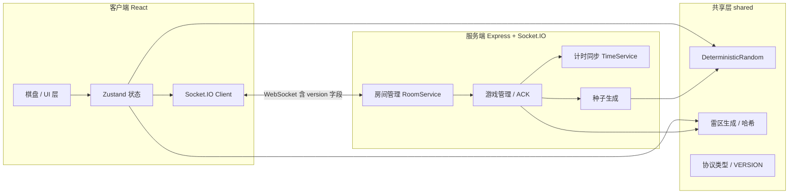
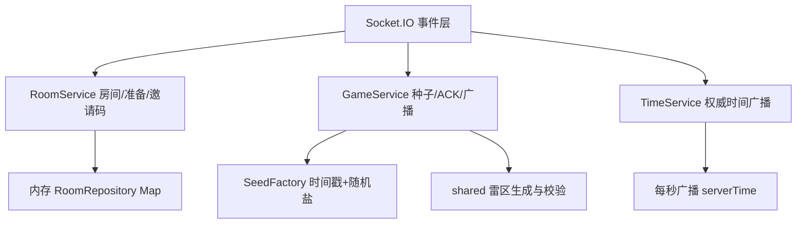

# 协同排雷 技术架构文档

## 1. 架构设计

采用 React + Express + Socket.IO 的全栈实时架构。确定性算法（PRNG、雷区生成、哈希）抽取到 `shared` 目录，前端与后端共用同一份 TypeScript 源码，确保算法同源。服务端为权威方，负责种子生成、ACK 校验、计时同步；客户端负责乐观渲染与本地对账。



## 2. 技术说明

- **前端**：React@18 + TypeScript + Vite + TailwindCSS + Zustand + react-router-dom + socket.io-client
- **后端**：Express + socket.io（ESM + TypeScript）
- **共享层**：`shared/deterministic.ts`（PRNG）、`shared/board.ts`（雷区生成与哈希）、`shared/protocol.ts`（消息类型与 `VERSION` 常量）
- **初始化工具**：vite-init 的 `react-express-ts` 模板
- **数据存储**：内存 `Map`（第 1-2 周无需数据库）

## 3. 路由定义

| 路由 | 用途 |
|-------|-------|
| `/` | 大厅页：创建房间 / 加入房间 |
| `/room/:code` | 房间页：等待状态 + 游戏状态（同页面状态切换） |

## 4. Socket 协议定义（含 version 字段）

所有消息体均含 `version: string` 字段，客户端与服务端校验 `version` 与 `shared/protocol.ts` 的 `ALGO_VERSION` 一致，不一致则拒绝并下发 `error` 事件。

### 4.1 客户端 → 服务端

```ts
// shared/protocol.ts
export const ALGO_VERSION = "1.0.0";

type C2S =
  | { type: "room:create"; version: string; playerName: string; difficulty: Difficulty }
  | { type: "room:join"; version: string; code: string; playerName: string }
  | { type: "room:leave"; version: string }
  | { type: "room:ready"; version: string; ready: boolean }
  | { type: "game:start"; version: string }            // 房主
  | { type: "cell:reveal"; version: string; opId: string; row: number; col: number }
  | { type: "cell:flag"; version: string; opId: string; row: number; col: number }
  | { type: "cell:chord"; version: string; opId: string; row: number; col: number }
  | { type: "time:sync"; version: string; clientTime: number };
```

### 4.2 服务端 → 客户端

```ts
type S2C =
  | { type: "room:state"; version: string; room: RoomSnapshot }
  | { type: "game:config"; version: string; seed: string; rows: number; cols: number; mineCount: number; mineHash: string }
  | { type: "game:started"; version: string; gameStartTimestamp: number }
  | { type: "cell:ack"; version: string; opId: string; ok: boolean; row: number; col: number; cells: RevealedCell[]; state: CellState; result?: "boom" }
  | { type: "cell:broadcast"; version: string; playerId: string; row: number; col: number; state: CellState; cells: RevealedCell[] }
  | { type: "time:sync"; version: string; serverTime: number }
  | { type: "error"; version: string; code: string; message: string };
```

## 5. 服务端架构图



## 6. 数据模型（内存）

第 1-2 周无需数据库，使用内存结构。`mineHash` 由 `shared/board.ts` 的 `computeMineHash` 生成，确保客户端与服务端雷位一致。

```ts
interface Room {
  code: string;                 // 6 位邀请码
  hostId: string;
  players: Player[];
  status: "waiting" | "playing" | "ended";
  difficulty: Difficulty;
  config?: GameConfig;          // seed + rows + cols + mineCount + mineHash
  gameStartTimestamp?: number;
}

interface Player { id: string; name: string; ready: boolean; isHost: boolean; }

interface GameConfig { seed: string; rows: number; cols: number; mineCount: number; mineHash: string; }

type CellState = "hidden" | "revealed" | "flagged" | "question";

interface RevealedCell { row: number; col: number; adjacent: number; isMine: boolean; }
```

## 7. 确定性算法要点

- `DeterministicRandom`：基于 `xfnv1a` 哈希将种子字符串映射为 32 位状态，再用 `sfc32`/`mulberry32` 产出序列。封装 `nextInt()` 与 `nextIntRange(max)`。
- 雷区生成：用 `DeterministicRandom` 做 Fisher-Yates 洗牌全索引数组，取前 `mineCount` 个为雷位，再计算每格邻雷数。
- `computeMineHash`：对雷位索引排序后拼接并哈希，服务端下发、客户端本地比对，防止算法版本错乱。
- `ALGO_VERSION` 写入每条 Socket 消息，服务端拒绝版本不匹配的客户端。
